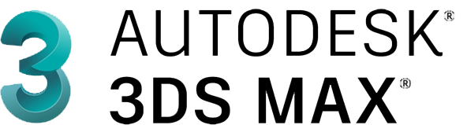

<!-- Counter Visits:START -->

<!-- Counter Visits:END -->

# </> Hi. I'm carjavi { }

### About me
I'm working in it !
https://carjavi.github.io/

 

### Connect with me:

   

   

   

   

   

    

     
 

 

---
### Languages and Tools: <!-- faltan los de autodesk ++++++++++++++++++++++-->

          
          
 

 

<!-- Design autodesk, Autocad, fusion, 3D studio, photoshop -->

---
### Hardware Used: 

 

 

 

 

 

---
### Design Tools:

 

 

---
### My Interests: 

     
     
    
     
    
    
              
    
    
    
    
    
    
     

 

 
     
          
---    
### Github Summary:   

<!-- Top Languages & GitHub Readme Stats:START -->

  

    <a href="https://github.com/carjavi/github-readme-stats">
      
  

  

    <a href="https://github.com/carjavi/github-readme-stats">
      
 

  
&nbsp;

  
&nbsp; 

<!-- Contribuciones :Start-->

  

     
  

<!-- Contribuciones :END -->

 

 

 

 

    

 

"Learning a computer language teaches you how to think" Steve Jobs 

 

 

 

 

 

  

    &nbsp;&copy; 2023 Instinto Digital
  

